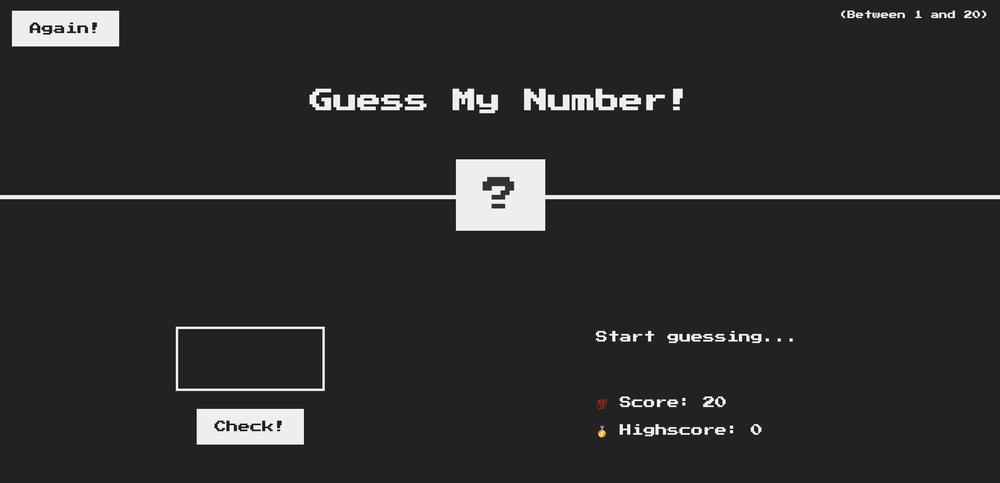
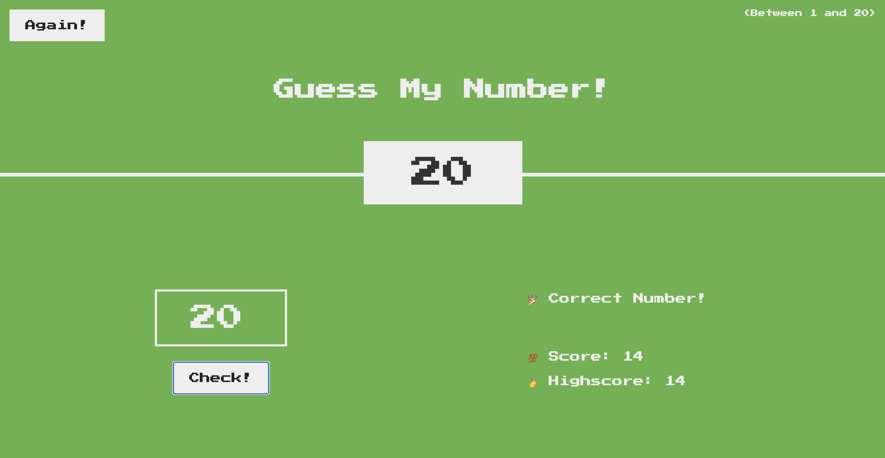

# Guess My Number Game

Welcome to the "Guess My Number" game! 🎲 This is a simple web-based game where players try to guess a randomly generated number between 1 and 20. This project demonstrates the use of HTML, CSS, and JavaScript to create an interactive game.




## Project Overview

In this game, the computer generates a random number within a specified range. The player inputs guesses, and the game provides feedback on whether the guess is too high, too low, or correct. The game continues until the player guesses the correct number.

## Features

- **Interactive Gameplay:** Users input their guesses through an HTML form and submit them using a button.
- **Feedback System:** Provides real-time feedback to the player about their guess.
- **Attempts Counter:** Displays the number of attempts made by the player.
- **Responsive Design:** The interface is styled to be responsive on both desktop and mobile devices.

## Technologies Used

- **HTML** for structuring the game elements.
- **CSS** for styling and layout.
- **JavaScript** for game logic and interactivity.

## How to Get Started

1. **Clone the Repository:**

   ```bash
   git clone https://github.com/SunilKumarKV/Guess-My-Number.git
   ```
2. **Navigate to the Project Directory:**
   ```bash
   cd guess-my-number
   ```
3. **Open the Project in a Web Browser:**

Simply open the `index.html` file in your web browser to start playing the game.

## How to Play
 - Enter a number between 1 and 20 in the input field.
 - Click the "Guess" button to submit your guess.
 - The game will provide feedback on whether your guess is too high, too low, or correct.
 - Continue guessing until you find the correct number. The game will display the number of attempts and congratulate you once you guess correctly.
   
## Contributing
 - Contributions are welcome! If you have suggestions for improvements or new features, feel free to fork the repository and submit a pull request.

## Acknowledgements
 - Inspired by classic number-guessing games.
 - Thanks to the open-source community for guidance and resources.
